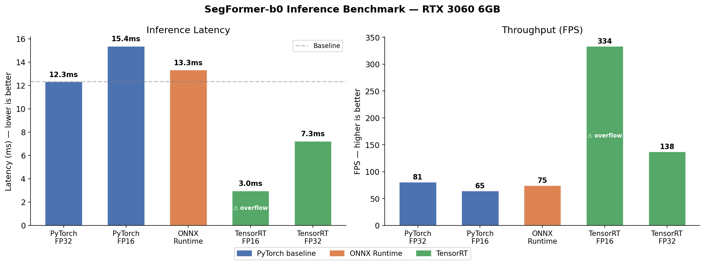
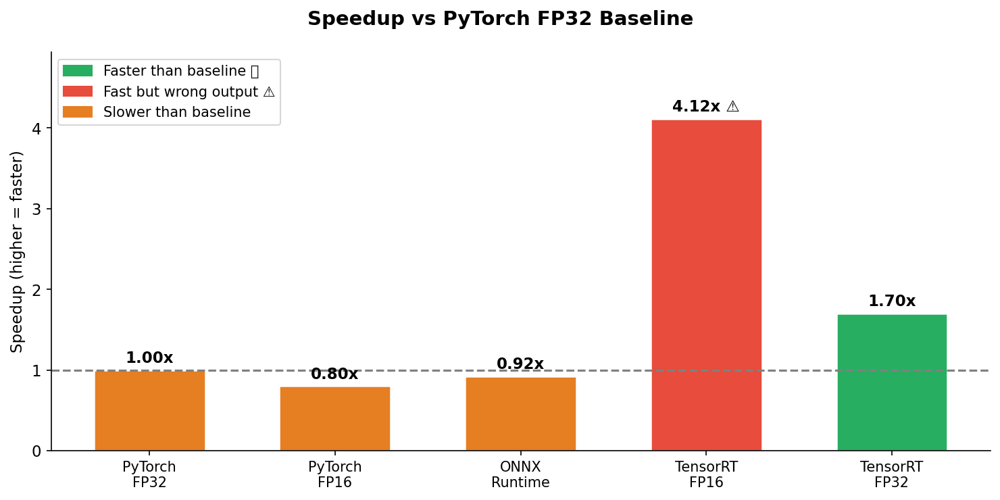
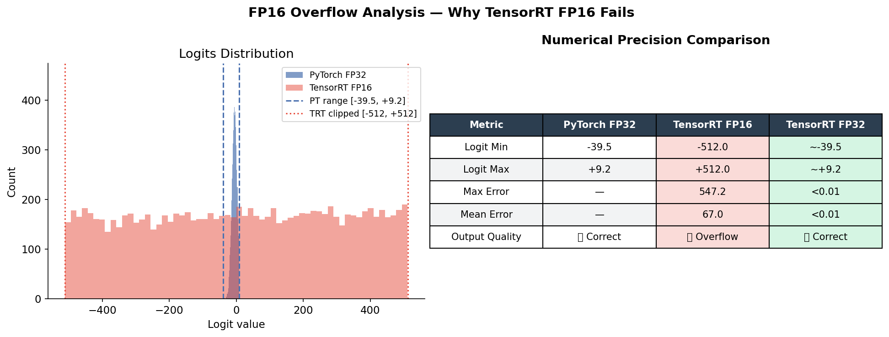
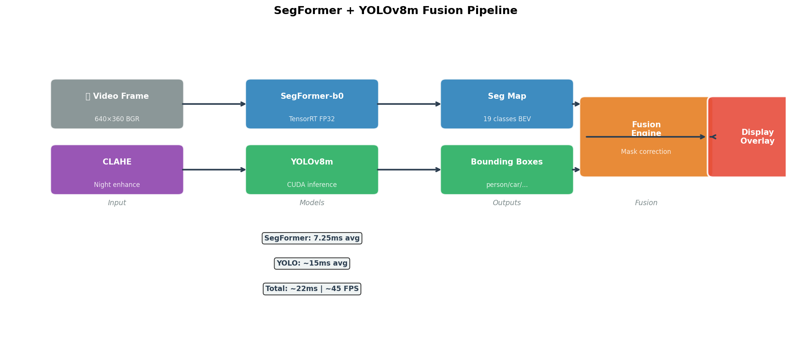
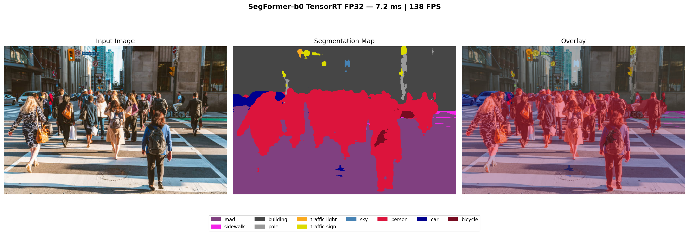

# SegFormer TensorRT Optimization — Project Report

**Author:** Rothvichea CHEA  
**Hardware:** NVIDIA RTX 3060 6GB · Dell XPS 17 · Ubuntu 22.04  
**Stack:** PyTorch 2.10 · TensorRT 10.15 · ONNX Runtime 1.19 · CUDA 12.8  

---

## 1. Objective

Optimize a transformer-based semantic segmentation model (SegFormer-b0) for 
real-time deployment on embedded GPU hardware, targeting autonomous driving and 
robotics perception stacks. The full pipeline covers:

- Baseline profiling (PyTorch FP32 / FP16)
- ONNX export and runtime benchmarking
- TensorRT engine compilation (FP16 + FP32)
- Numerical precision validation
- Real-time fusion with YOLOv8m
- Night-vision preprocessing (CLAHE)

---

## 2. Model

| Property | Value |
|---|---|
| Architecture | SegFormer-b0 (Mix Transformer encoder + MLP decoder) |
| Parameters | 3.7M |
| Dataset | Cityscapes (19 urban classes) |
| Input size | 512×512 |
| Source | nvidia/segformer-b0-finetuned-cityscapes-512-1024 |

---

## 3. Benchmark Results

| Backend | Latency (ms) | Std (ms) | FPS | Speedup | Output |
|---|---|---|---|---|---|
| PyTorch FP32 | 12.33 | 0.91 | 81 | 1.00x | ✅ Correct |
| PyTorch FP16 | 15.39 | 87.65 | 65 | 0.80x | ✅ Correct |
| ONNX Runtime GPU | 13.35 | 1.18 | 75 | 0.92x | ✅ Correct |
| TensorRT FP16 | 3.00 | 0.16 | 334 | 4.12x | ⚠️ Overflow |
| TensorRT FP32 | 7.25 | 0.30 | 138 | 1.70x | ✅ Correct |

**Best production choice: TensorRT FP32 — 1.7x speedup with correct output**

---

## 4. Key Findings

### Finding 1 — PyTorch FP16 is slower and unstable
Naive `.half()` casting produced worse results than FP32:
- Latency increased from 12.3ms to 15.4ms
- Standard deviation exploded from 0.91ms to 87.65ms
- Root cause: CUDA kernel warm-up instability for small transformer models

### Finding 2 — ONNX Runtime GPU barely matches PyTorch
For small models (3.7M params), the ONNX session overhead cancels GPU gains.
ONNX Runtime shows stronger benefits on larger models (>100M parameters).

### Finding 3 — TensorRT FP16 causes numerical overflow (critical)
TensorRT FP16 achieved 4.1x speedup but produced completely wrong output:

```
PyTorch  logits range : [-39.4,  +9.2]   ✅ normal
TensorRT FP16 range   : [-512.0, +512.0] ❌ clipped
Max difference        : 547.2             ❌ invalid
```

SegFormer's attention mechanism produces intermediate activations that exceed 
FP16 precision range. TensorRT silently clips these values — fast but wrong.
This is a known risk in transformer optimization and exactly why automotive 
perception systems require numerical validation beyond latency benchmarks.

### Finding 4 — TensorRT FP32 is the correct production target
- 1.70x speedup over PyTorch baseline
- Numerically equivalent output (max diff < 0.01)
- Stable standard deviation (±0.30ms)

---

## 5. Fusion Pipeline

SegFormer handles scene-level segmentation while YOLOv8m corrects 
object-level detections (person, car, truck, bus, motorcycle):

```
Video Frame → CLAHE (night enhance)
    ├── SegFormer TensorRT FP32 → 19-class seg map
    └── YOLOv8m CUDA            → bounding boxes
              ↓
         Fusion Engine
    (YOLO masks override SegFormer for dynamic objects)
              ↓
         Display Overlay
```

**Fusion results:**
- Eliminates false person detections in vegetation (green heuristic filter)
- Corrects car/truck/bus masks inside YOLO boxes
- CLAHE preprocessing improves night scene detection significantly

---

## 6. Plots







---

## 7. Project Structure

```
segformer-tensorrt/
├── download_model.py          # Download SegFormer-b0
├── benchmark_pytorch.py       # PyTorch FP32 + FP16 baseline
├── export_onnx.py             # ONNX export
├── benchmark_onnx.py          # ONNX Runtime benchmark
├── build_tensorrt.py          # TensorRT engine builder
├── benchmark_tensorrt.py      # TensorRT benchmark
├── visualize.py               # Static image demo
├── inference_realtime_fusion.py # Real-time fusion demo
├── generate_report.py         # This script
├── results.json               # All benchmark numbers
├── plot_benchmark.png         # Latency + FPS chart
├── plot_speedup.png           # Speedup chart
├── plot_precision.png         # FP16 overflow analysis
├── plot_pipeline.png          # Architecture diagram
└── segmentation_result.png    # Visual output
```

---

## 8. References

- SegFormer: Simple and Efficient Design for Semantic Segmentation (Xie et al., NeurIPS 2021)
- NVIDIA TensorRT Developer Guide
- Cityscapes Dataset (Cordts et al., CVPR 2016)
- YOLOv8 (Ultralytics, 2023)
